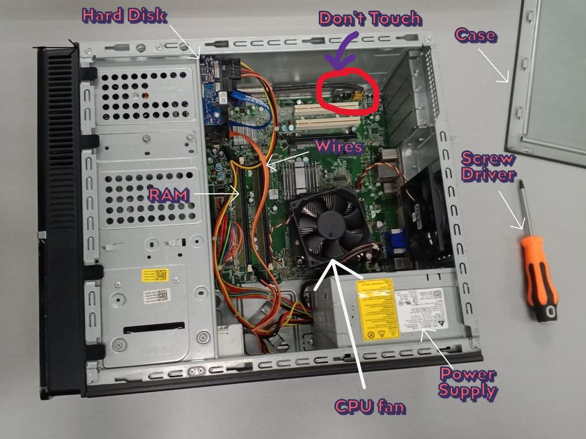

<html>
  <head>
        <meta charset="UTF-8">
        <meta name="viewport" content="width=device-width, initial-scale=1.0">

        

        <!--Linked The Files CSS-->
        <link rel="stylesheet" href="index.css">
        <!--End of Linked-->

        <!--Import Font From Google Font-->
        
        <!--End of Import Fonts From Google Font-->

    </head>
  <body>
    <!--Contents-->
                    

                        

                            <h2 id="Title" style="color: black;">PC Assembel</h2> 
                                
                                
<u>06 November 2024</u> 
                                    

                                         
Today morning, I learn how to Assembel and reassemble a PC. This is a new experienced for me
                                            eventho I'm really scared if the PC got damage but it is fun to play with it. Here are some step to assembel a PC:
                                            <ul id="steps">
                                                 <li>Open the case</li>
                                                <li>Take off all the connected wires.</li>
                                                <li>Take off the power supply</li>
                                                <li>Take off the RAM</li>
                                                <li>Take off the Hard Disk</li>
                                                <li>Take off the CPU fan</li>
                                            </ul> 
                                            For reassemble, just reverse the steps. Hopefully it runs well.
                                            After the Lab, we going to take a quiz about what we learnt before. It's easy if you remember the steps.
                                        

                                    

                                

  </body>
</html>
